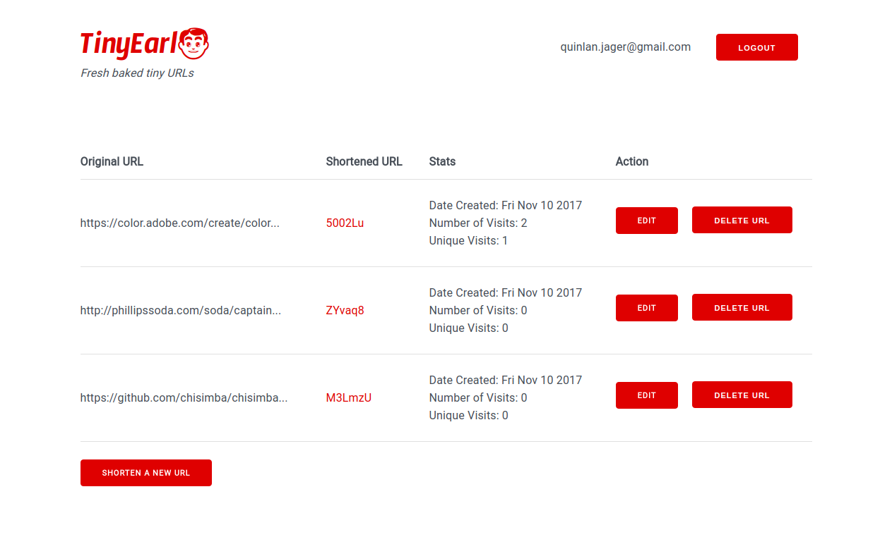
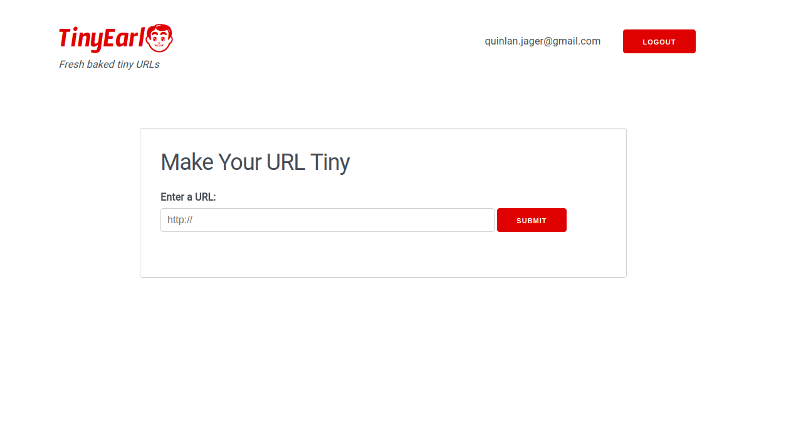

# TinyEarl

TinyEarl is a web application used to shorten URLs. This full stack web app is built with Node and Express. The project was created as part of the Lighthouse Labs curriculum. I was the sole developer on this project.

## Final Product

**Index screen when logged in:**

**Generate new URL screen when logged in:**

## Dependencies and Frameworks

### Server Side
* Node
* Express
* EJS
* body-parser
* cookie-session
* dotenv
* bcrypt

### Client Side/Styling
* Milligram

## Using the App

* Download all dependencies with `npm install`.
* Run the development server by using the `npm start` command.

## Features and Functionality

After registering an account, users can create short urls that will be associated with their account. These urls can be shared anywhere. 

Client-side session management (implemented using cookie-sessions) makes the application stateful without compromising security. Bcrypt is used for password encryption to ensure the protection of user information. 

Users can also track how many times a URL has been visited and how many unique visitors the URL has had.

