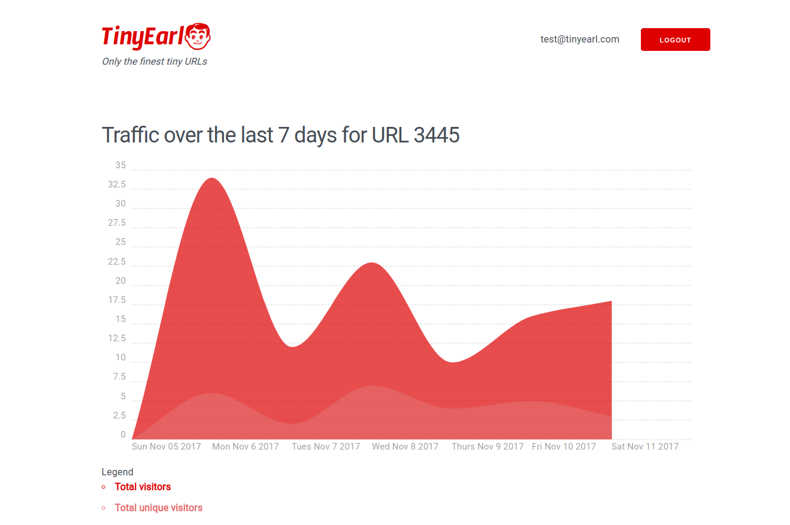

# TinyEarl

TinyEarl is a web application used to shorten URLs. This full stack web app is built with Node and Express. The project was created as part of the Lighthouse Labs curriculum. I was the sole developer on this project.

The app has a modular design which makes it a breeze to expand and add new features.

## Final Product

**Index screen when logged in:**

**Generate new URL screen when logged in:**

**View graph of traffic**

## Dependencies and Frameworks

### Server Side
* Node
* Express
* EJS
* body-parser
* cookie-session
* dotenv
* bcrypt

### Client Side/Styling
* Milligram
* Chartist

## Using the App

* Download all dependencies with `npm install`.
* Run the development server by using the `npm start` command.
* On the login screen, you can use the email `test@tinyearl.com` and the password `tinyearl` to give the app a test run. Or you can register with your own account.

## Features and Functionality

After registering an account, users can create short urls that will be associated with their unique identifier. These urls can be shared anywhere but only the person who created the URL can manage it.

Users can track how many times a URL has been visited as well as unique visitors. To get a better idea of their traffic over time, users can access a graph of a URL's unique and total traffic over the previous 7 days. 

Data is shared for the chart using XMLHttpRequests to dynamically created JSON files.

Client-side session management is used to make the application stateful. To minimize the security risks that come with client-side sessions, cookie-session is used. Lastly, bcrypt is the application's password encryption tool of choice. 

